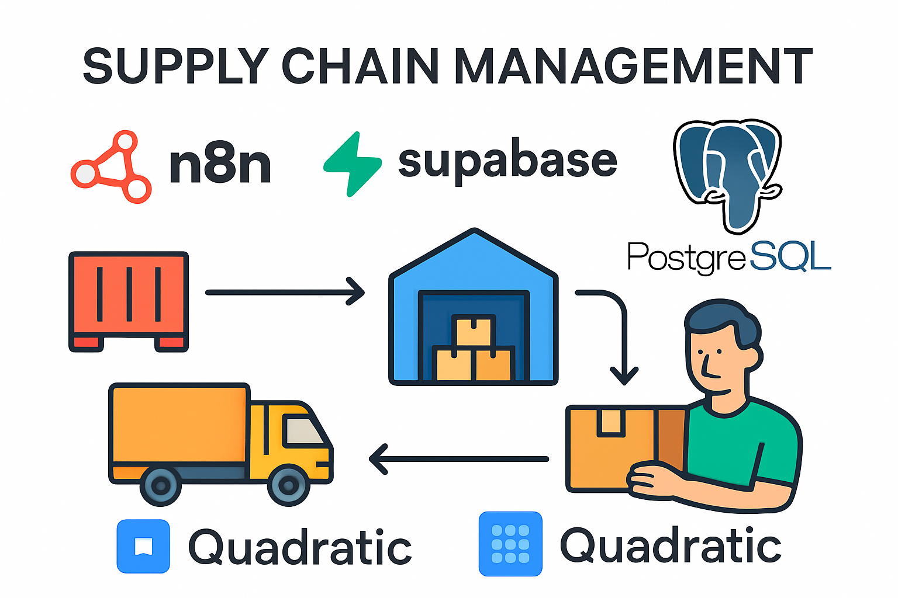
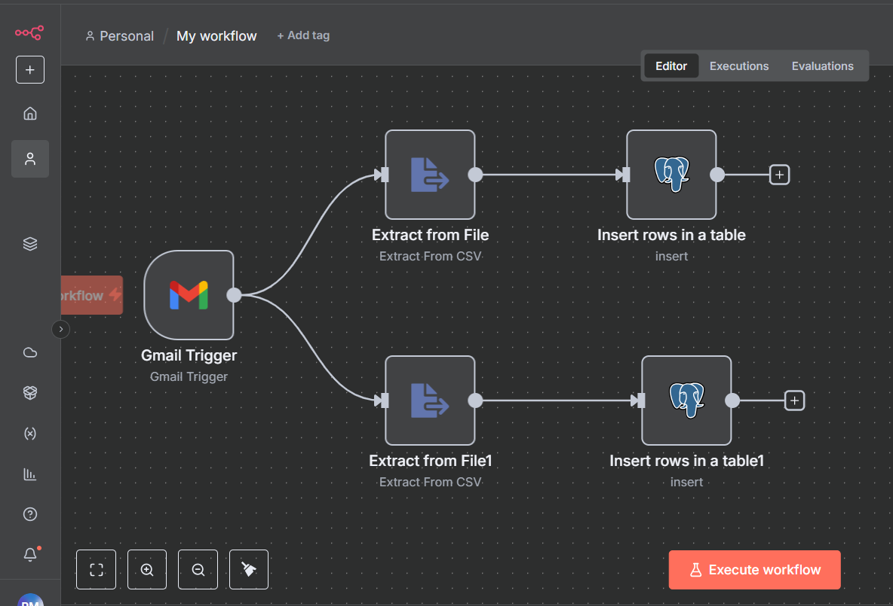
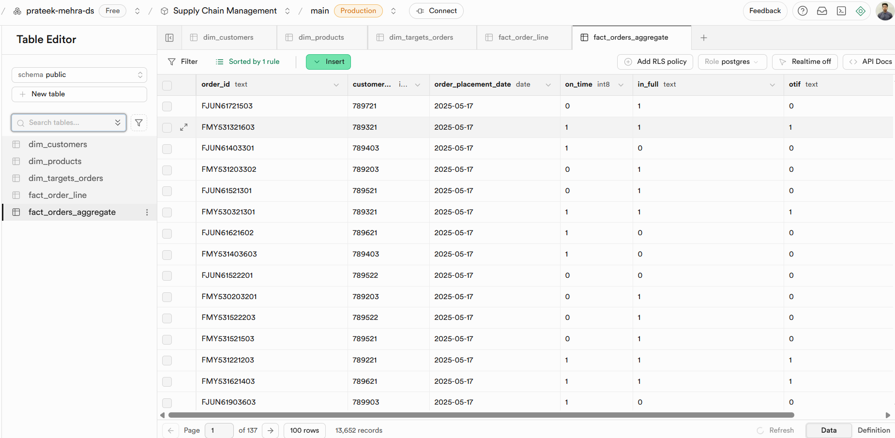
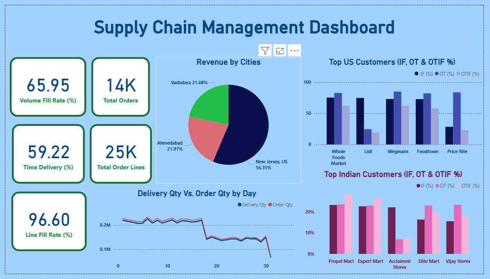

---

# 📦 Supply Chain Management Data Analysis – AI Automated Workflow

This project demonstrates an **end-to-end automated pipeline** for supply chain management using **N8N, Supabase, Quadratic AI, and Power BI**. The workflow ingests raw data, stores it in a cloud database, performs AI-powered data analysis, and visualizes KPIs through dashboards.

---



## 🚀 Tech Stack

* **[N8N](https://n8n.io/):** AI-powered automation tool used for workflow creation and raw data ingestion.
* **[Supabase](https://supabase.com/):** Cloud-hosted PostgreSQL database for structured data storage.
* **[Quadratic](https://www.quadratichq.com/):** AI-driven spreadsheet for prompt-based data analysis.
* **[Power BI](https://powerbi.microsoft.com/):** Business Intelligence tool for dashboard creation.

---

## 🔄 Workflow Overview

1. **Trigger Setup in N8N**

   * Create workflow with **Gmail API trigger** to fetch incoming files.
   * Extract data from attachments into **JSON format**.

2. **Data Ingestion**

   * Configure **Supabase API** in N8N.
   * Ingest extracted JSON data into PostgreSQL (Supabase).

3. **Integration with Quadratic**

   * Connect Supabase database session parameters with Quadratic.
   * Map database tables into Quadratic sheets.

4. **AI-Powered Analysis**

   * Use **Chat Sheet functionality** in Quadratic to:

     * Create derived tables.
     * Perform KPIs & customer analysis.
     * Track top vendors/customers.

5. **Exchange Rate Monitoring**

   * Create a table using **Open Exchange Rates API**.
   * Fetch and monitor real-time currency exchange data.

6. **Visualization**

   * Save the Quadratic sheet (`supply_chain_management.xlsx`).
   * Build **interactive dashboards** in Power BI.

---





---
📈 Dashboard
The Power BI dashboard provides interactive insights on:

- Revenue by cities
- Top US Customers
- Top Indian Customers
- Delivery Qty Vs. Order Qty
- KPI's
---
  

## 📂 File Structure

```
├── data/                      # Raw dataset files  
├── dashboard/                 # Power BI dashboards (scm_dashboard.pbix)  
├── workflow/                  # N8N workflows (n8n_workflow)  
├── outputs/                   # Final outputs (supply_chain_management.xlsx)  
├── quadratic_prompt/          # Prompt files for Quadratic (prompts.txt)  
└── README.md                  # Documentation  
```

---

## 🛠️ How to Run

1. **Setup N8N Workflow**

   * Connect Gmail API as trigger.
   * Configure Supabase API credentials.
   * Execute the workflow to ingest data.

2. **Connect Supabase with Quadratic**

   * Add Supabase session parameters.
   * Map database tables into Quadratic sheets.

3. **Perform AI Analysis**

   * Use **prompts.txt** for predefined analysis.
   * Create new tables & generate KPIs directly via prompts.

4. **Exchange Rate Table**

   * Configure **Open Exchange Rates API** in Quadratic.
   * Monitor real-time exchange fluctuations.

5. **Visualization**

   * Export final dataset (`outputs/supply_chain_management.xlsx`).
   * Load into Power BI → Build dashboard → Publish.

---

## 💡 Why Use This?

✔️ Automates **data ingestion → storage → analysis → visualization**.
✔️ Scalable for multiple supply chain datasets.
✔️ Real-time exchange rate monitoring integrated.
✔️ No manual SQL/ETL overhead — powered by AI prompts.
✔️ End-to-end reproducible pipeline.

---

## 📊 Demo Output

* **Dataset:** Stored in `data/`
* **Quadratic Analysis:** Saved in `outputs/supply_chain_management.xlsx`
* **Power BI Dashboard:** Available in `dashboard/scm_dashboard`

---

## 🔗 Future Improvements

* Add **alerting system** in N8N for KPI thresholds.
* Automate **Power BI refresh** via API.
* Extend prompts for **predictive modeling (demand forecasting, anomaly detection)**.

---

## 📌 Author

👤 **Prateek Mehra**
🔗 [LinkedIn](https://linkedin.com/in/prateekmehrads) 

---

👉 If you like this project, don’t forget to ⭐ **star the repo** and share feedback!

---

